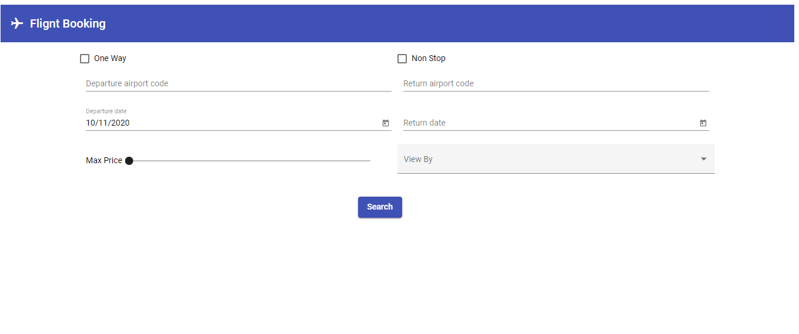
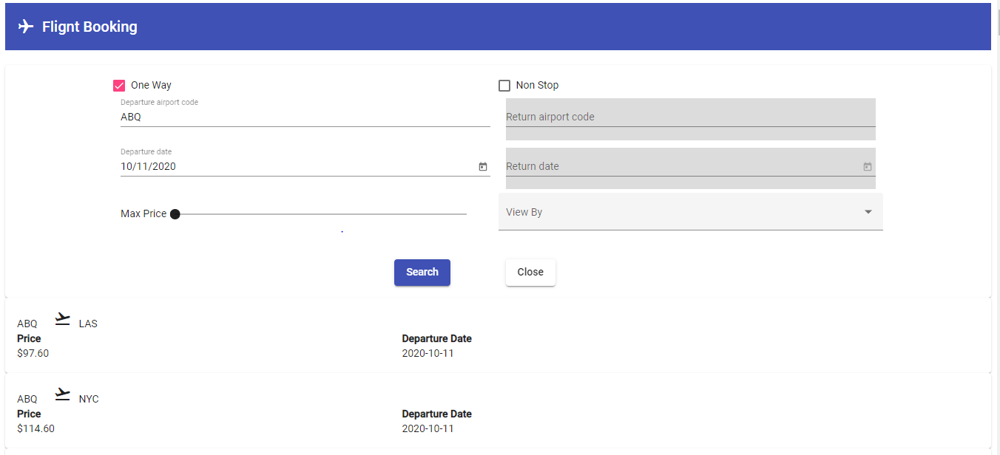

---
---

# Home : Flight Search

## Document History

| **Version Number** |  **Date**  | **Edited by** | **Change/Comments**  |
| :----------------: | :--------: | :-----------: | :------------------: |
|        1.0         | 11-10-2020 |  Deepak Shah  | Intial Documentation |

# 1.0 Document Purpose and target group

This document is a part of the Flight search.

**Introduction**

```
This is a website which help travelers discover their next destination by finding the cheapest flight destinations from a specific city.
```

**Screen (Flight Search- 001)**

**Layout**

```
The below layout shows the search view of flight.
```



```
The below layout shows the list of flights available based on search criteria.
```


```
The below layout shows edit view of searched flights.
```



```
The below layout shows error message view.
```


**Actions**

| **Element Name** | **User Action** |                 **System Action**                 | **Status** |
| :--------------: | :-------------: | :-----------------------------------------------: | :--------: |
|      Search      |      Click      | Search for flights avaible as per search criteria |  Enabled   |
|       Edit       |      Click      |          enable to edit search criteria           |  Enabled   |
|      Close       |      Click      |         Close edit view of flight search          |  Enabled   |

**Localization**

| **Element** | **Localization Key** | **English Text** | **Other language Text** |
| :---------: | :------------------: | :--------------: | :---------------------: |
|     N/A     |         N/A          |       N/A        |           N/A           |

**Error Message**

|             **Discription**              |    **Trigger**     |
| :--------------------------------------: | :----------------: |
|               INVALID DATE               | Depends on backend |
|              INVALID FORMAT              | Depends on backend |
| PARAMETER COMBINATION INVALID/RESTRICTED | Depends on backend |
|          INVALID DATA RECEIVED           | Depends on backend |
|          MANDATORY DATA MISSING          | Depends on backend |
| ITEM/DATA NOT FOUND OR DATA NOT EXISTING | Depends on backend |
|             Unexpected error             | Depends on backend |
